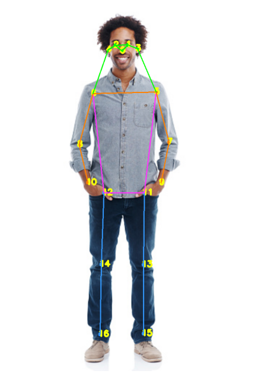

# AI GYM Helper
### Pose Estimation Project

This project is about counting curls and making sure elbows are tucked in using YOLOv7 for pose estimation. I'm using OpenCV and YOLOv7 to detect the human body parts and then estimate the angle between each three points using the dot product.
#### Angles Tracked
| Angles| Points                              |
|-------|-------------------------------------|
| Left:<br/>arm: [6, 8, 10]<br/>elbow: [12, 6, 8] |  |
| Right:<br/>arm: [5, 7, 9]<br/>elbow: [11, 5, 7]| ^                                   |

### Demo


### Installation
1. Clone the project repository from GitHub.
2. Install the necessary packages in `requirements.txt`.
```bash
git clone https://github.com/moaaztaha/GYM-assistant-using-Yolov7-pose-estimation
cd  GYM-assistant-using-Yolov7-pose-estimation
pip install -r requirements.txt
```
### Usage
```bash
python gym_helper.py -h
usage: GYM Helper [-h] [-mp MODEL_PATH] [-min ANGLE_MAX] [-max ANGLE_MIN] [-thr THRESHOLD]

Counting curls and making sure elbows are tucked in.

optional arguments:
  -h, --help            show this help message and exit

general:
  -mp MODEL_PATH, --model_path MODEL_PATH
                        path to model .pt file

finetune:
  -min ANGLE_MAX, --angle_max ANGLE_MAX
                        angel at which a curl is completed
  -max ANGLE_MIN, --angle_min ANGLE_MIN
                        angel at which a curl is started
  -thr THRESHOLD, --threshold THRESHOLD
                        the maximum for elbow angle from body

Thanks for using my app.

```

### References

[Find the Angle between three points from 2D using python](https://manivannan-ai.medium.com/find-the-angle-between-three-points-from-2d-using-python-348c513e2cd)
